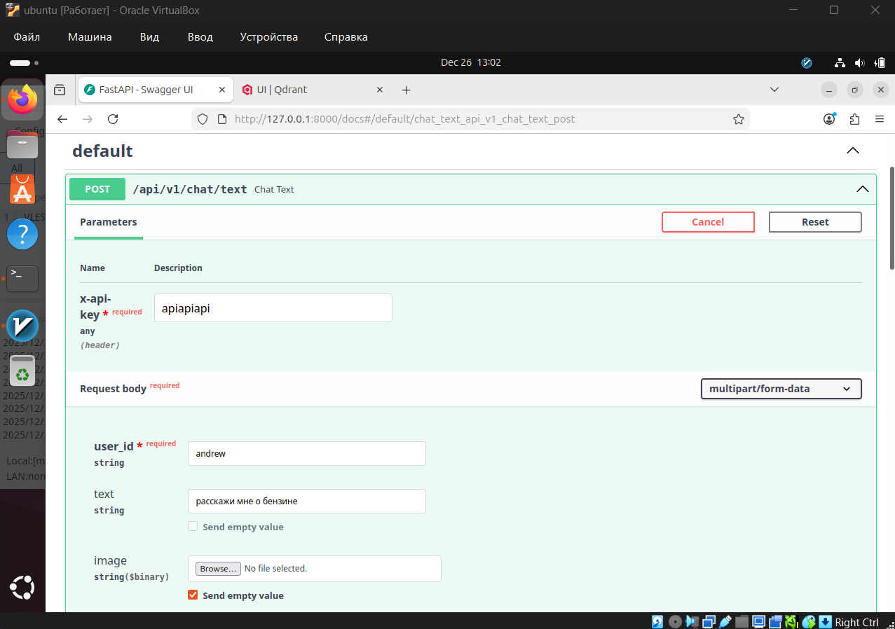
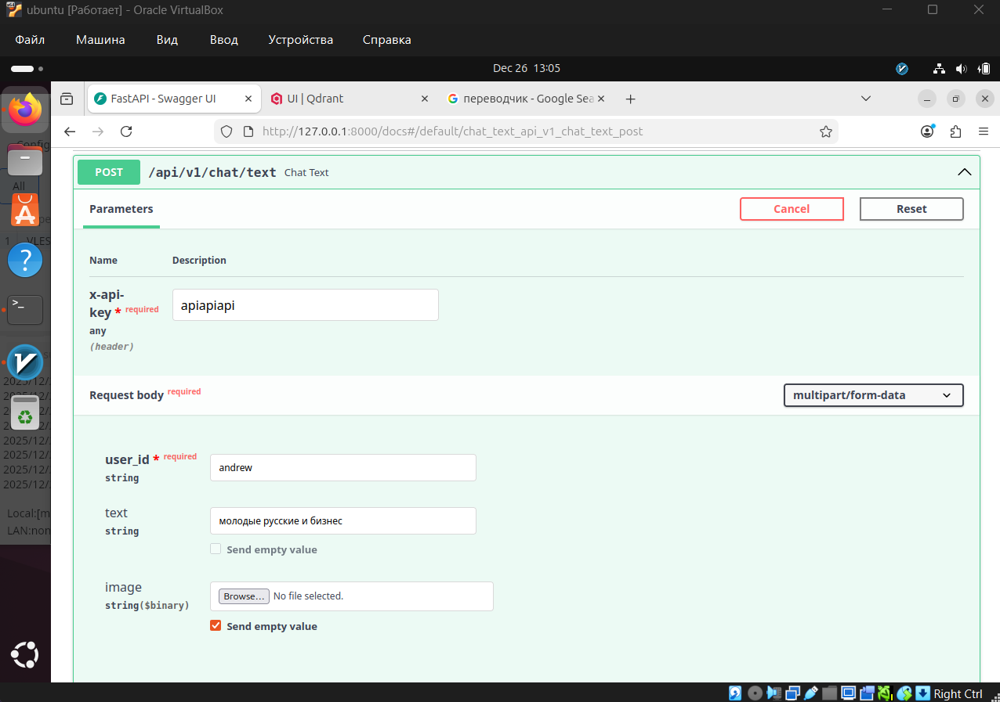
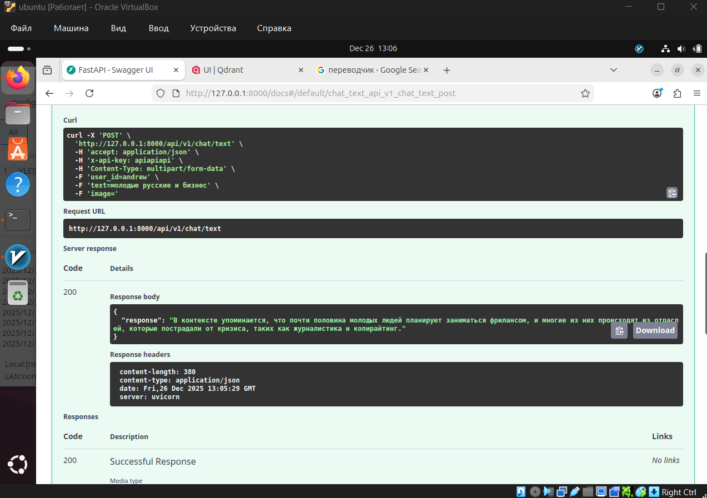
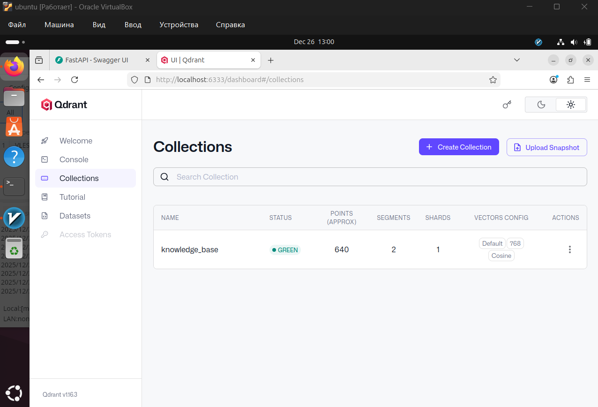
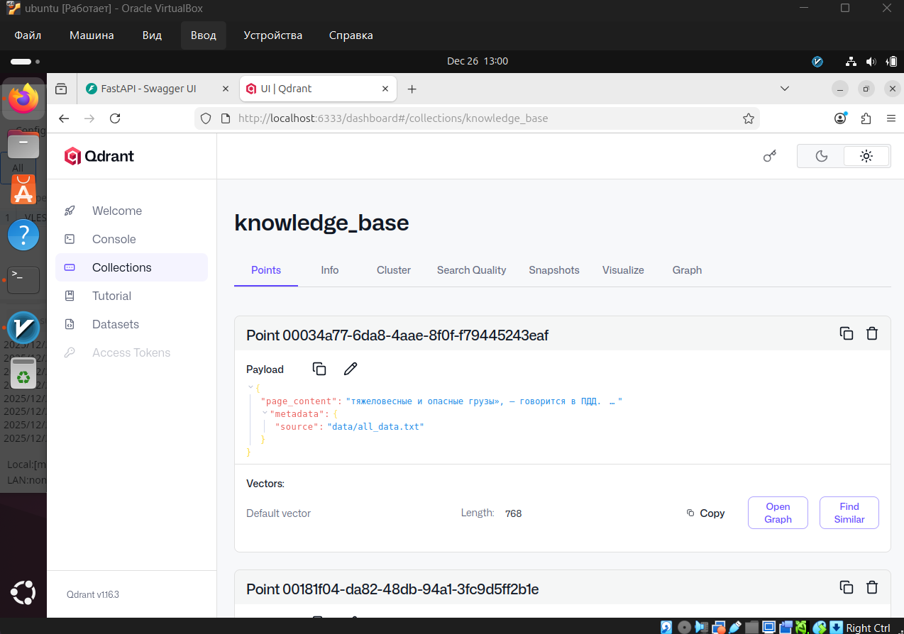
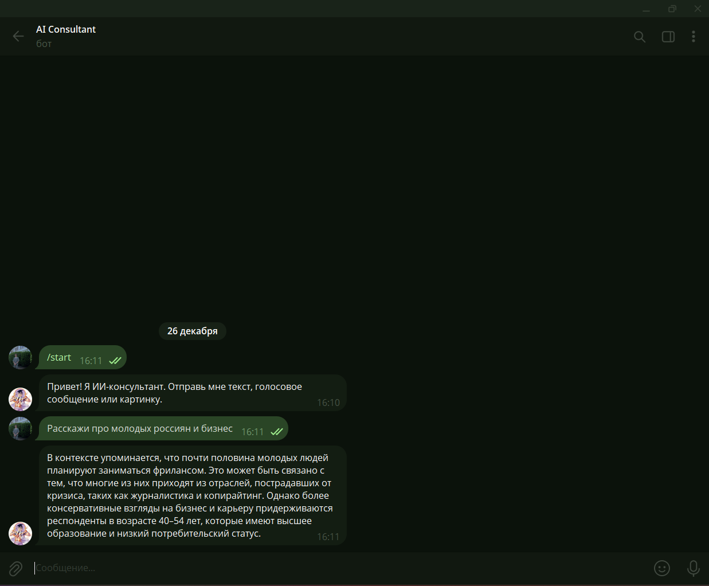

# ai-consultant
Тестовое задание: Разработка простого ИИ-консультанта

## Описание
В основе лежит новостной датасет gazeta от IlyaGusev. Генерация ответов и анализ изображений выполняются через OpenAI GPT-4o-mini, векторизация текста производится локально через Ollama с моделью nomic-embed-text, а транскрибация аудио осуществляется через Groq API (Whisper). В качестве векторного хранилища используется Qdrant, история диалогов и логи сохраняются в PostgreSQL через SQLAlchemy. Проект полностью контейнеризирован с помощью Docker Compose и включает отдельный клиентский модуль в виде Telegram-бота на Aiogram 3.

## Развертывание
Для развертывания склонируйте репозиторий, создайте файл ```.env``` и укажите необходимые ключи API (OpenAI, Groq). Выполните сборку и запуск инфраструктуры командой ```docker compose up -d --build```. После поднятия контейнеров необходимо загрузить модель эмбеддингов, выполнив команду ```docker exec -it ai_ollama ollama pull nomic-embed-text```. После завершения загрузки модели перезапустите сервис приложения командой ```docker compose restart app```, чтобы скрипт инициализации наполнил векторную базу. Для старта клиентской части установите зависимости и запустите файл ```python bot/bot.py```.

## Примеры работы решения






